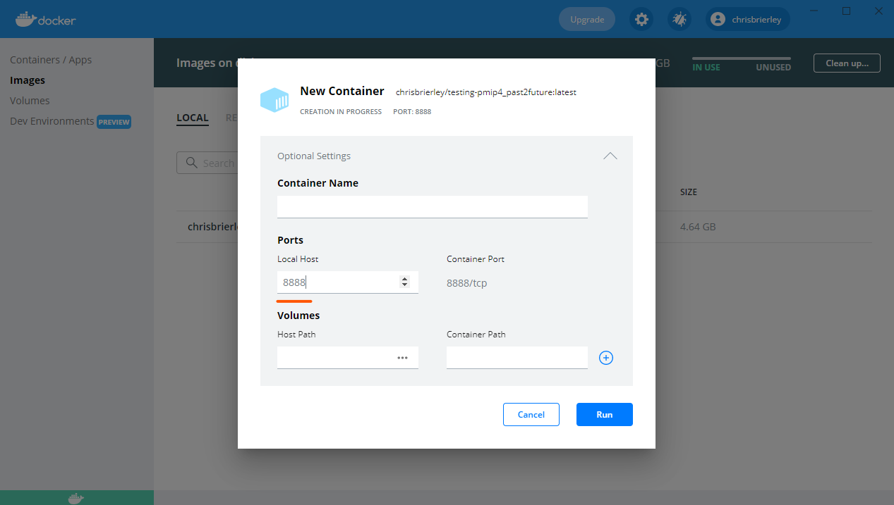

# Step by step instructions to use this repository

## Using as a data source

We would prefer it if you sign into GitHub and fork the repository. This allows us to know who has used the data for our own interest. We can then also invite you to join the PMIP4 organization on GitHub as a research collaborator. To fork a repository, go to the [github page](https://github.com/pmip4/pmip_p2fvar_analyzer) of this repository, and click on the **Fork** icon.

 

You should also just be able to download the individual files from GitHub directly. If the CSV files do not show a download link, you may need to copy and paste the text of the file instead.  

## Using as a code and data source

You can download all the code and data as a single zipped archive from GitHub. 

We would prefer it if you sign into GitHub and fork the repository. This allows us to know who has used the data for our own interest. We can then also invite you to join the PMIP4 organization on GitHub as a research collaborator. To fork a repository, go to the [github page](https://github.com/pmip4/pmip_p2fvar_analyzer) of this repository, and click on the **Fork** icon.

## Using as a interactive application via Docker

### Install Docker on your machine

Docker is a piece of software that allow you to run individual applications in their own little container. This means that you can run Linux code, such as this repository, on a Windows or Mac machine. If you are running in a Linux cluster already, you can use the command line version of Docker. 

It is somewhat easier to use [Docker Desktop](https://www.docker.com/products/docker-desktop). This is graphical application that allows you to run peice of software (called images) by pointing and clicking. You may want to peruse the [Docker documentation](https://docs.docker.com/get-started/).

### Run the Docker Image

Firstly, you will need to download the _image_ of the software from [Docker Hub](https://hub.docker.com/r/chrisbrierley/testing-pmip4_past2future). You can do this using following command 

> docker pull chrisbrierley/testing-pmip4_past2future

Secondly you need to run this docker image. You can do this by just pressing the `Run` button next to the image listing in Docker Desktop. You also need to set up some port-forwarding to allow the Jupyter Notebook talk to your browser...

### Access the Jupyter Server (for Python)

By starting the docker image, you have actually started to run a Jupyter server on your machine. This comes installed with the data and series of sensible python packages. You can see which packages exist by looking at the [environment.yml](https://github.com/pmip4/pmip_p2fvar_analyzer/blob/master/environment.yml) file, which determines the contents of the conda environment.

You then need to navigate to your browser. Navigate to [http://127.0.0.1:8888/lab?token=easy](http://127.0.0.1:8888/lab?token=easy) (if it asks for a password use "easy"). This will then show a directory tree of the repository. Please then navigate the python notebook you want to interact with.

### Access the terminal (for NCL)

By starting the docker image, you have actually started to run virtual machine. You can then navigate to its terminal and use NCL in its normal fashion.